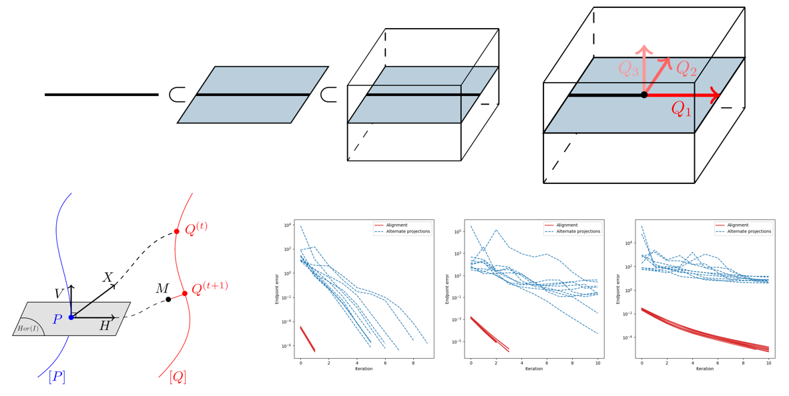

# flag-manifold-distance
Authors' implementation of the paper "Rethinking the Riemannian logarithm on flag manifolds as an orthogonal alignment problem", accepted with oral to the [GSI'23 6th International Conference on Geometric Science of Information](https://conference-gsi.org/).



### Installation
You can create a conda environment and then install the required packages by running the followig commands on the Anaconda prompt.
```python
conda create -n flag-manifold-distance python=3.9
pip install -r requirements.txt
```

### Notes
- The code has been open-sourced for reproducibility purposes.
- An improvement of its structure, docstring and readability, as well as the design of an explanatory notebook with more details and illustrations will be considered between now and the conference.
- An integration of the code into [`geomstats`](https://github.com/geomstats/geomstats), an open-source Python package for geometric statistics, will be considered in the future. 
