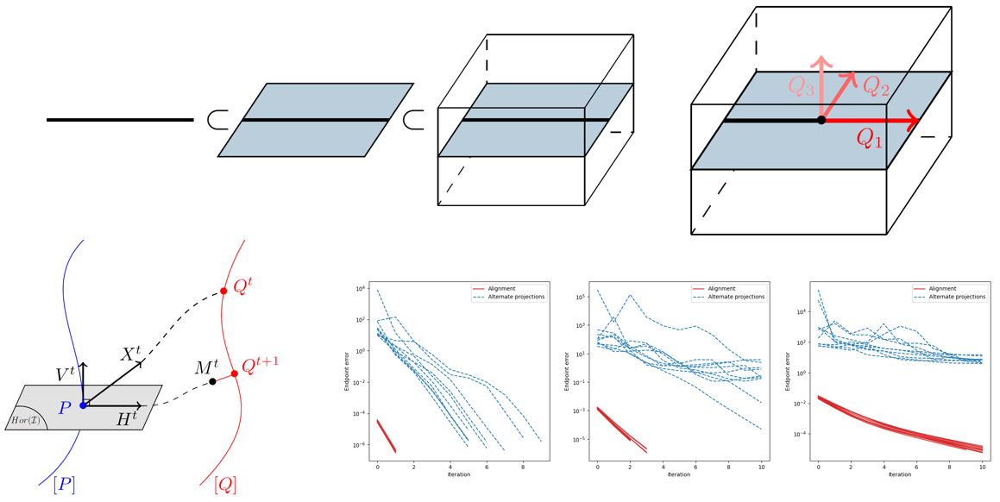

# flag-manifold-distance
Authors' implementation of the paper ["Rethinking the Riemannian Logarithm on Flag Manifolds as an Orthogonal Alignment Problem"](https://inria.hal.science/hal-04100534), accepted with oral to the [GSI'23 6th International Conference on Geometric Science of Information](https://conference-gsi.org/).



### Installation
You can create a conda environment and then install the required packages by running the followig commands on the Anaconda prompt.
```python
conda create -n flag-manifold-distance python=3.9
pip install -r requirements.txt
```

### Notes
- The code has been open-sourced for reproducibility purposes.
- An improvement of its structure, docstring and readability, as well as the design of an explanatory notebook with more details and illustrations will be considered between now and the conference.
- An integration of the code into [`geomstats`](https://github.com/geomstats/geomstats), an open-source Python package for geometric statistics, will be considered in the future. 


### Citation
The paper will appear in the Springer Proceedings of the Geometric Science of Information 6th International Conference, GSI 2023.
For now, if you use this work, you can cite the preprint version:
```bibtex
@unpublished{szwagier_rethinking_2023,
  TITLE = {{Rethinking the Riemannian Logarithm on Flag Manifolds as an Orthogonal Alignment Problem}},
  AUTHOR = {Szwagier, Tom and Pennec, Xavier},
  URL = {https://inria.hal.science/hal-04100534},
  NOTE = {working paper or preprint},
  YEAR = {2023},
  MONTH = May,
  KEYWORDS = {Flag manifolds ; Riemannian logarithm ; Orthogonal alignment ; Procrustes analysis},
  PDF = {https://inria.hal.science/hal-04100534/file/GSI-119.pdf},
  HAL_ID = {hal-04100534},
  HAL_VERSION = {v1},
}
```